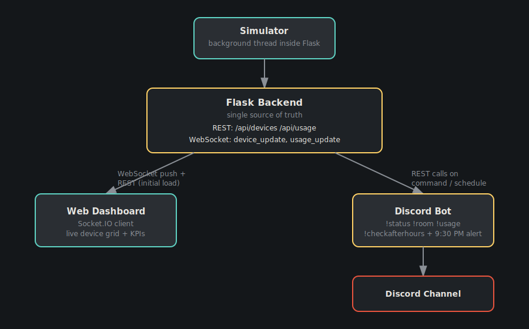

# Office Energy Monitor

A real-time system for monitoring simulated lights and fans across the office — accessible through a live web dashboard and a Discord bot — built to solve one recurring problem: people leaving devices on after hours and driving up the electricity bill.

## Overview

The office has 3 rooms — **Drawing Room**, **Work Room 1**, and **Work Room 2** — each with 2 fans and 3 lights (18 devices total). Since there's no real hardware, a background simulator mimics realistic office behavior by randomly toggling devices on and off over time. A Flask backend holds the live state of every device and streams updates in real time to a web dashboard over WebSockets, while a Discord bot queries the same backend on demand — so both interfaces always reflect the same reality.

## Architecture



- **Simulator** (a background thread inside Flask) mutates the in-memory device state on a timer, giving each device an independent random chance to flip on/off.
- **Flask Backend** is the single source of truth. It exposes REST endpoints (`GET /api/devices`, `GET /api/usage`) and pushes live updates over WebSocket (`device_update`, `usage_update`) to any connected dashboard.
- **Web Dashboard** connects via Socket.IO for live pushes, and also calls the REST endpoints once on page load so it shows correct data immediately, before the first update arrives.
- **Discord Bot** never touches Flask's memory directly — it calls the same REST endpoints whenever a command is run (`!status`, `!room`, `!usage`, `!checkafterhours`), and also on a daily 9:30 PM schedule to check for devices left on and alert a Discord channel.

Because both the dashboard and the bot read from the exact same backend, they can never show conflicting information — there is only ever one live copy of the truth.

A rendered copy of this diagram is included at `diagrams/architecture.svg` so it displays correctly on GitHub/GitLab without relying on any diagramming syntax.

## Features Implemented

### Backend (Flask + Flask-SocketIO)
- In-memory data model for all 18 devices, each tracking: `status` (on/off), `type` (fan/light), `room`, `last_changed` (timestamp), and `total_on_seconds` (cumulative on-time, banked every time a device turns off)
- Background simulator loop giving each device an independent random chance to flip state on every tick — avoids all devices changing in lockstep, producing more realistic, staggered behavior
- Real-time push via WebSocket:
  - `device_update` — broadcast whenever device states change
  - `usage_update` — broadcast every tick with current power/energy figures
- REST API (shared by both the dashboard's initial load and the Discord bot):
  - `GET /api/devices` — full current state of every device
  - `GET /api/usage` — current power draw (W), total accumulated energy (kWh), and estimated cost
- Centralized `calculate_usage()` function — single source of truth for all power/energy math, used by both the REST endpoint and the live WebSocket broadcast, avoiding duplicated/drifting logic

### Web Dashboard
- Live-updating device cards grouped by room, reflecting real-time on/off status with zero page refreshes
- KPI panel showing current power draw (W), total energy used (kWh), and estimated cost
- Initial state fetched via REST on page load, then kept live via WebSocket — dashboard is always correct, even before the first simulator tick
- Dark, control-room-style visual design: devices glow (color-coded by type — amber for lights, teal for fans) with a pulsing animation when on, and recede into the background when off, making wasted energy visually obvious at a glance

### Discord Bot
- `!status` — summarizes how many devices are on/off per room, office-wide
- `!room <name>` — status of a specific room (supports friendly aliases, e.g. `work1` → Work Room 1)
- `!usage` — current power draw, accumulated energy, and estimated cost, pulled live from the same backend as the dashboard
- `!checkafterhours` — checks whether any device is still on and reports which ones (manual trigger for demo purposes)
- Scheduled after-hours check — automatically runs once daily at 9:30 PM and posts an alert to a designated Discord channel if any device is still on, directly addressing the original problem of lights/fans being left running
- Optional natural-language response formatting via LLM (Groq), with automatic fallback to plain formatted text if the LLM call fails or is unavailable — ensures the bot never goes silent
- Error handling around all backend calls (timeouts, connection failures) so the bot degrades gracefully instead of crashing if Flask is unreachable

## Project Structure

```
office-energy-monitor/
├── app.py                  # Flask app: routes, WebSocket events, simulator
├── devices.py               # Initial device data (rooms, types, starting state)
├── bot.py                    # Discord bot: commands + scheduled after-hours check
├── requirements.txt
├── .env.example              # Template for required environment variables
├── templates/
│   └── index.html            # Dashboard page
├── static/
│   ├── css/style.css
│   └── js/script.js
└── diagrams/
    └── architecture.png      # Rendered system architecture diagram
```
(Adjust the tree above to match your actual filenames if they differ.)

## Getting Started

These steps take you from a fresh clone to a fully running system: Flask backend + dashboard in one terminal, Discord bot in another.

### Prerequisites
- Python 3.10+ installed
- A Discord account, and permission to add a bot to a server (use your own test server if you don't have one — see Step 2)
- Git

### 1. Clone the repository
```bash
git clone https://github.com/himi19122005/iut.git
cd iut
```

### 2. Create a Discord Bot Application
1. Go to the [Discord Developer Portal](https://discord.com/developers/applications) and log in.
2. Click **New Application**, give it a name (e.g. "Office Energy Bot"), and create it.
3. In the left sidebar, go to **Bot** → click **Reset Token** (or **Add Bot** if you don't see a token yet) → copy the token. **Keep this secret — never commit it.**
4. On the same Bot page, scroll to **Privileged Gateway Intents** and enable **Message Content Intent** (required for the bot to read commands).
5. In the left sidebar, go to **OAuth2 → URL Generator**:
   - Under **Scopes**, check `bot`
   - Under **Bot Permissions**, check `Send Messages`, `Read Message History`, `View Channels`
   - Copy the generated URL at the bottom, open it in your browser, and select a server to add the bot to (create your own test server first if needed: Discord → **+** → **Create My Own**)
6. Once the bot is in your server, enable **Developer Mode** in Discord (User Settings → Advanced → Developer Mode), then right-click the text channel you want alerts sent to and **Copy Channel ID** — save this for Step 4.

### 3. Set up a Python virtual environment
```bash
python -m venv venv
source venv/bin/activate      # macOS/Linux
venv\Scripts\activate         # Windows
```

### 4. Install dependencies
```bash
pip install -r requirements.txt
```
If there's no `requirements.txt` yet, generate one after installing everything locally:
```bash
pip freeze > requirements.txt
```
It should include at minimum: `flask`, `flask-socketio`, `discord.py`, `python-dotenv`, `requests`, and `groq` (if using the optional LLM phrasing feature).

### 5. Configure environment variables
Copy the example file and fill in your real values:
```bash
cp .env.example .env
```
Edit `.env`:
```
DISCORD_BOT_TOKEN=your-bot-token-from-step-2
DISCORD_CHANNEL_ID=your-channel-id-from-step-2
GROQ_API_KEY=your-groq-key-here        # optional, only needed if using LLM phrasing
FLASK_URL=http://localhost:5000
```
`.env` is already listed in `.gitignore` and must never be committed.

### 6. Run the Flask backend (dashboard + simulator + API)
```bash
python app.py
```
Visit **http://localhost:5000** in your browser — you should see the dashboard, with device cards updating live every couple of seconds as the simulator runs.

### 7. Run the Discord bot (in a second terminal)
Make sure the virtual environment is activated in this terminal too, then:
```bash
source venv/bin/activate   # if not already active
python bot.py
```
Check the terminal for `Logged in as <bot-name>` and confirm the bot shows online in your Discord server.

### 8. Try it out
In your Discord server:
- `!status` — overall office summary
- `!room drawingroom` (or `work1`, `work2`) — status of one room
- `!usage` — current power draw, energy used, estimated cost
- `!checkafterhours` — manually trigger the after-hours check (also runs automatically every day at 9:30 PM)

On the dashboard, watch devices flip on/off in real time and the KPI numbers update without refreshing the page.

### Troubleshooting
- **Bot doesn't respond to commands**: confirm `Message Content Intent` is enabled in the Developer Portal (Step 2.4), and that the bot has permission to view/send messages in the channel you're testing in.
- **`!status`/`!usage` reply with a connection error**: make sure `app.py` (Flask) is running first, and that `FLASK_URL` in `.env` matches the port Flask is actually running on.
- **Dashboard shows no devices**: check the browser console for errors, and confirm you're visiting the correct port shown in the Flask terminal output.

## Tech Stack
- **Backend**: Python, Flask, Flask-SocketIO
- **Frontend**: HTML, CSS, vanilla JavaScript, Socket.IO client
- **Bot**: Python, discord.py, requests
- **Optional AI layer**: Groq API (LLM-based response phrasing)

## Why This Design
- **Single source of truth**: All device state and power calculations live in one place (the Flask process). The dashboard and Discord bot are both simply clients of that one backend, guaranteeing they can never show conflicting information.
- **True real-time, not polling**: The dashboard uses WebSocket server-push, so updates appear instantly as they happen rather than on a delay from periodic refreshing.
- **Resilience**: Both the bot and dashboard handle backend downtime gracefully rather than crashing or hanging.

